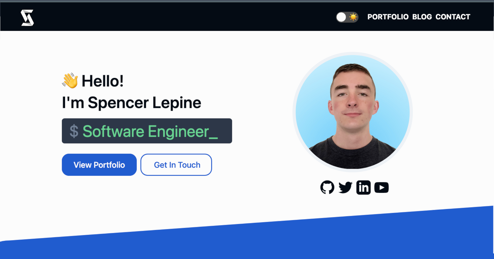

# [SpencerLepine.com](https://www.spencerlepine.com/) Portfolio Site

[](https://github.com/spencerlepine/portfolio-site/actions/workflows/ci.yml) [](https://github.com/spencerlepine/portfolio-site/actions/workflows/netlify.yml) [](https://github.com/spencerlepine/portfolio-site/actions/workflows/link-check.yml) [](https://github.com/spencerlepine/portfolio-site-uptime/actions?query=workflow%3A%22Uptime+CI%22) [](https://github.com/spencerlepine/portfolio-site/actions/workflows/lighthouse.yml)




## ⭐ How It's Built

Personal developer portfolio and blog site. Built with static content using static content for Gatsby and GraphQL. This was built from scratch with React and TailwindCSS, which includes a light/dark theme toggle.

# ✅ View Site Uptime

Head over to the [**status website →**](https://spencerlepine.github.io/portfolio-site-uptime) powered by [Upptime](https://github.com/spencerlepine/portfolio-site-uptime)


## 📦 Technologies

- [GatsbyJS](https://www.gatsbyjs.com/)
- [React](https://reactjs.org/)
- [GraphQL](https://graphql.org/)
- [TailwindCSS](https://tailwindcss.com/)
- [Netlify](https://www.netlify.com/)

## ⚙️ Development Setup
```sh
$ git clone https://github.com/spencerlepine/portfolio-site.git
$ cd portfolio-site
$ yarn install
$ yarn start
# access on localhost:3000
```
