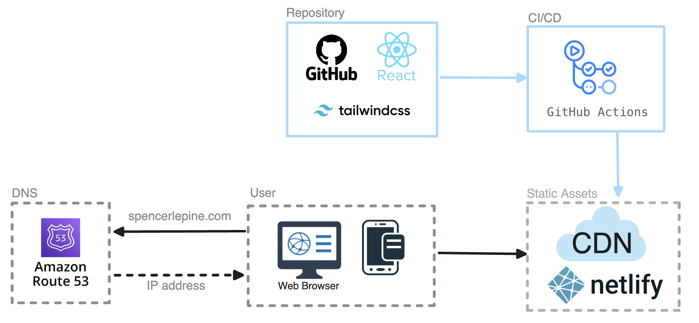
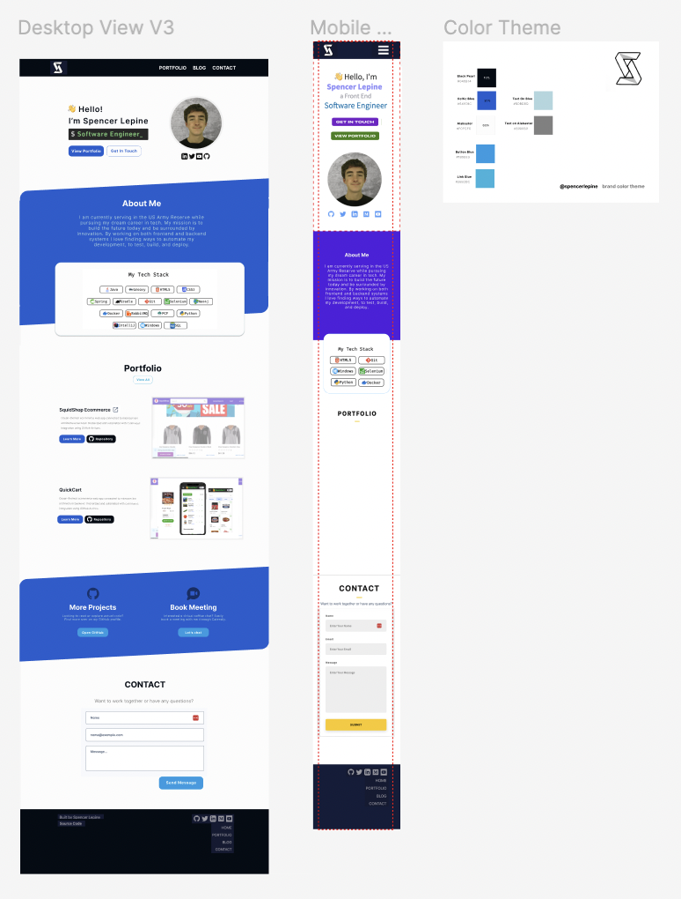

# [SpencerLepine.com](https://www.spencerlepine.com/) Portfolio Site

[](https://github.com/spencerlepine/spencerlepine.com/actions/workflows/ci.yml) [](https://github.com/spencerlepine/spencerlepine.com/actions/workflows/netlify.yml) [](https://github.com/spencerlepine/spencerlepine.com/actions/workflows/link-check.yml) [](https://github.com/spencerlepine/spencerlepine.com-uptime/actions?query=workflow%3A%22Uptime+CI%22) 

<!-- [](https://github.com/spencerlepine/spencerlepine.com/actions/workflows/lighthouse.yml) -->




## ❓ What Is This?

My personal developer portfolio and blog site.

## 📦 Technologies

- [GatsbyJS](https://www.gatsbyjs.com/)
- [React](https://reactjs.org/)
- [GraphQL](https://graphql.org/)
- [TailwindCSS](https://tailwindcss.com/)
- [Netlify](https://www.netlify.com/)
- [AWS Route53](https://aws.amazon.com/route53/)

## ⭐ How It's Built

This was built from scratch with React and TailwindCSS, which includes a light/dark theme toggle. Using MDX content, static pages are generated with Gatsby and GraphQL. Automatically deploys to netlify, with routing on AWS Route53 for the domain.

Using Figma, I created the designs to follow and basic component layout of the site:



## 📁 Previous Versions

- V1: https://github.com/spencerlepine/portfolio-site-v1
- V2: https://github.com/spencerlepine/portfolio-site-v2

## ✅ View Site Uptime

Head over to the [**status website →**](https://spencerlepine.github.io/portfolio-site-uptime) powered by [Upptime](https://github.com/spencerlepine/portfolio-site-uptime)

## ⚙️ Development Setup
```sh
$ git clone https://github.com/spencerlepine/spencerlepine.com.git
$ cd spencerlepine.com
$ yarn install
$ yarn start
# access on http://localhost:8000
```
