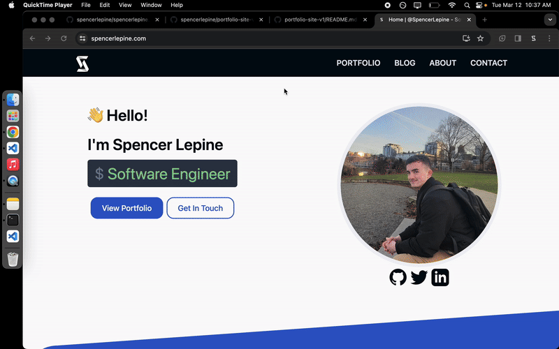

# [SpencerLepine.com](https://www.spencerlepine.com/) Portfolio Site

Portfolio site v2 for Spencer Lepine, deployed with [Netlify](https://www.netlify.com/)
 to [spencerlepine.com](https://spencerlepine.com/).

```
v2 Portfolio Site (Sep 2022 - Sep 2024)
spencerlepine.com (netlify + Route53)
```

[](https://github.com/spencerlepine/spencerlepine.com/actions/workflows/ci.yml) [](https://github.com/spencerlepine/spencerlepine.com/actions/workflows/netlify.yml) [](https://github.com/spencerlepine/spencerlepine.com/actions/workflows/link-check.yml) [](https://github.com/spencerlepine/spencerlepine.com-uptime/actions?query=workflow%3A%22Uptime+CI%22)




## 📦 Technologies

- [GatsbyJS](https://www.gatsbyjs.com/)
- [React](https://reactjs.org/)
- [GraphQL](https://graphql.org/)
- [TailwindCSS](https://tailwindcss.com/)
- [Netlify](https://www.netlify.com/)
- [AWS Route53](https://aws.amazon.com/route53/)
- [HeroTofu](https://herotofu.com/) (Contact Form)

## Features

- **Contact form:** functional contact form forwarding inquires to my personal email (using [HeroTofu](https://herotofu.com/))
- **Automated CI/CD:** [GitHub Action](https://docs.github.com/en/actions) workflows to automate CI (build/test/lint), image compression pull requests, typo scanning, and Netlify deployment.
- **Custom Blog:** a custom-built blog (static posts + hashtags) built using Markdown files and [GatsbyJS](https://www.gatsbyjs.com/)
- **Automated Uptime Monitor:**: free/automated 365/24/7 uptime monitor hosted entirely on GitHub: [portfolio-site-uptime](https://github.com/spencerlepine/portfolio-site-uptime)
- **Contact Form Canary:**: automated (free) web crawler canary for the contact form, hosted entirely on GitHub: [portfolio-site-contact-form-canary](https://github.com/spencerlepine/portfolio-site-contact-form-canary)
- **Google Analytics:** free analytics tracking for site usage
- **Lighthouse CI:** GitHub Actions workflow to run [Google Lighthouse](https://developer.chrome.com/docs/lighthouse/overview) scans for performance + accessibility

## ⭐ How It's Built

This was built from scratch with React and TailwindCSS, which includes a light/dark theme toggle. Using MDX content, static pages are generated with Gatsby and GraphQL. Automatically deploys to netlify, with routing on AWS Route53 for the domain.

Using Figma, I created the designs to follow and basic component layout of the site:


## ✅ View Site Uptime

Head over to the [**status website →**](https://spencerlepine.github.io/portfolio-site-uptime) powered by [Upptime](https://github.com/spencerlepine/portfolio-site-uptime)

## ⚙️ Development Setup

```sh
$ git clone https://github.com/spencerlepine/spencerlepine.com.git
$ cd spencerlepine.com
$ yarn install
$ yarn start
# access on http://localhost:8000
```
