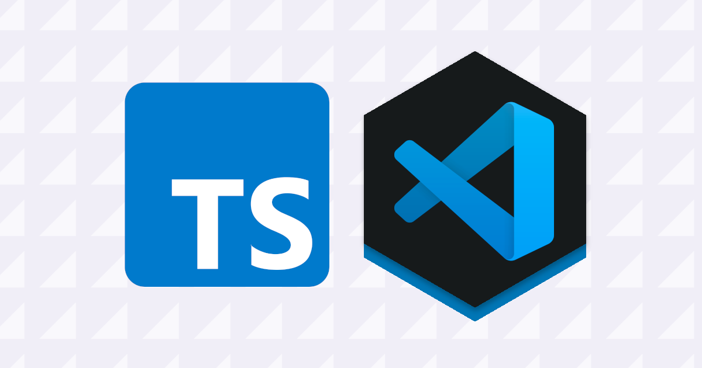

<!-- MARKDOWN CONTENT -->



Looking to set up VSCode for a TypeScript project? This article will walk through the initial configuration steps for just that.

This walk-through assumes you have the already have the following installed:

- [VSCode](https://code.visualstudio.com/)
- [Node.js](https://nodejs.org/en/download/)
- [npm](https://docs.npmjs.com/downloading-and-installing-node-js-and-npm)

To begin, let’s install the `typescript` module globally:

```sh
$ npm install -g typescript
$ tsc --version
```

Great! Now we can code our `.ts` files. A small issue remains. In order to compile those files to `.js`, we must run `tsc` or `npm run build` manually. To avoid this, we can auto-compile __on save__ in our IDE.

## Configure Auto-Compile on Save

Using the build tasks in VSCode, you can trigger auto-compile on save. This can be done through the settings search bar, or the application's menu bar in macOS.

### Option 1:

- Enter `CMD+SHIFT+P`
- Select: `Tasks: Configure Default Build Task`
- Choose: `tsc: watch - tsconfig.json`

### Option 2:

- Find tabs: in OS VSCode menu bar
- Click: `Terminal` (open dropdown)
- Select: `Configure Default Build Task`
- Choose: `tsc watch` option

Now during development, anytime you save the `.ts` files, it will generate `.js` output automatically.

## Hiding Compiler Output In Editor File Tree

After running `tsc build`, it will populate the directory with compiled files. You may find `.js`,  `.js.map`,  or `.d.ts.` files, which could be useful to explore when learning. However, these can clutter up the file tree in the IDE.

There is an easy was to hide these files in the workspace, without deleting them from the file system.

To configure the following VSCode settings, it can be done in the global `settings.json` file, or for the projects workspace

To set up a workspace, Do `"CMD+SHIFT+P" => "Preferences: Open Workspace Settings"`. This creates the `<rootDir>/.vscode/settings.json` file in the project directory.  Note, you include the `.vscode` folder in the git history, unless a team is not sharing these settings.

To find the  settings file do `"CMD+SHIFT+P" => "Preferences: Open User Settings (JSON)"` or `"CMD+SHIFT+P" => "Preferences: Open Workspace Settings"`.

Add the following options for file ignoring to the VSCode `settings.json`:
```json
{
    "files.exclude": {
        "**/.git": true,
        "**/.DS_Store": true,
        "**/*.js.map": true,
        "**/*.js": {"when": "$(basename).ts"}
    }
}
```

Or

```json
{
  "files.exclude": {
    "**/.git": true,
      "**/.DS_Store": true,
    "**/*.d.ts": {
      "when": "$(basename).ts"
    },
    "**/*.js": {
      "when": "$(basename).ts"
    },
    "**/*.js.map": {
      "when": "$(basename)"
    }
  }
}
 ```


## Using .gitignore

When using git for your TypeScript project, you are not committing the compiled  JavaScript code. You most likely will ignore the  files generated, so you can configure that in the `.gitignore`.  Be aware of needed files however, for example a `jest.config.js` file.

Keeping the source `.ts` files, a `.gitignore` file may look like this:

```diff
*.js
!jest.config.js
*.d.ts
node_modules
!lambda/*.js
```

## Configure Format On Save

Optionally, you can avoid wasting time on formatting with `formatOnSave`. Add the following key to your `settings.json` file to enable:

```json
"[typescript]": {
    "editor.defaultFormatter": "esbenp.prettier-vscode",
    "editor.formatOnSave": true
  }
```

## Conclusion

That's it! You can now begin development for your new TypeScript project, with auto-compile and format-on-save enabled.  The main purpose of this article was to document the setup project for my own use, and strengthen my understanding by teaching.

---

That’s all for today, I hope this article was helpful. If you have any questions, feel free to connect with me. You can find my profiles here:
* [Twitter (@spencerlepine)](https://twitter.com/SpencerLepine)
* [GitHub (@spencerlepine)](https://github.com/spencerlepine)
* [LinkedIn](https://www.linkedin.com/in/spencer-lepine/)
* [YouTube (Spencer Lepine)](https://www.youtube.com/channel/UCBL6vAHJZqUlyJp-rcFU55Q)
